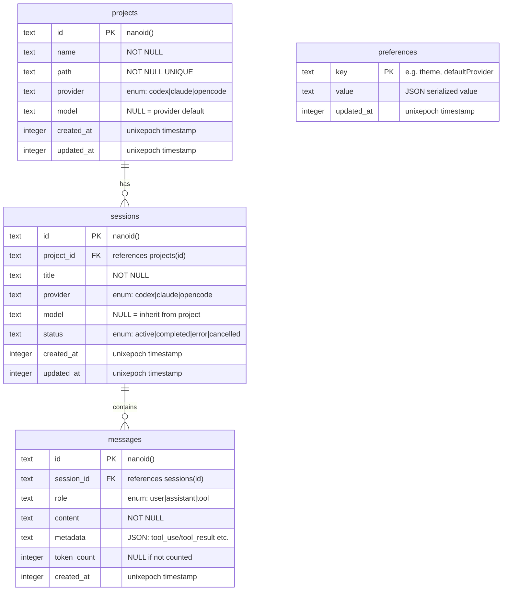

# 数据库表结构设计文档

> **文档定位**：本文档是数据库层的唯一真相源（Single Source of Truth）。
> 修改表结构、新增字段、调整索引策略前，**必须先更新此文档**，保证"有据可依"。
>
> **项目**：code-name-one — 本地 AI 编程工作台
> **作者**：架构团队
> **最后更新**：2026-03-23

---

## 目录

1. [选型决策](#1-选型决策)
2. [数据库初始化规范](#2-数据库初始化规范)
3. [ER 关系图](#3-er-关系图)
4. [完整 Drizzle Schema 定义](#4-完整-drizzle-schema-定义)
5. [关系定义（Drizzle Relations）](#5-关系定义drizzle-relations)
6. [索引策略](#6-索引策略)
7. [迁移策略](#7-迁移策略)
8. [Repository 层接口规范](#8-repository-层接口规范)
9. [类型导出](#9-类型导出)
10. [踩坑预警](#10-踩坑预警)

---

## 1. 选型决策

### 为什么选 SQLite + Drizzle ORM

这是一个**本地优先（Local-first）**的单机工作台应用，不需要多节点分布式写入，用户数据存在本机就够了。选型的核心原则：**零运维、强类型、快启动**。

| 维度 | 选型 | 决策理由 |
|------|------|---------|
| **数据库引擎** | SQLite | 单文件数据库，零配置，应用自带，无需用户安装任何服务 |
| **运行时驱动** | `bun:sqlite` | Bun 原生内置，零额外依赖，性能比 `better-sqlite3` 更好 |
| **ORM 层** | Drizzle ORM | 类型安全与 strict TypeScript 完全匹配，SQL-like API 无"魔法"，学习成本低 |
| **迁移工具** | drizzle-kit | 与 Drizzle ORM 配套，自动生成 SQL 迁移文件，支持 push/generate 两种工作流 |
| **并发模型** | WAL 模式 | Write-Ahead Logging 允许多个读操作与单个写操作并发，适配 Hono 处理多个 SSE 连接的场景 |

### 关键约束说明

- SQLite **不支持**真正的并发写，WAL 模式解决的是"读不阻塞写"，写操作仍是串行的
- 本地工作台场景下，单用户并发写压力极低，SQLite 完全足够
- 如果未来需要多用户/云端部署，数据库层需替换为 PostgreSQL（Drizzle 支持平滑迁移）

---

## 2. 数据库初始化规范

### 文件路径规约

```
project-root/
├── data/
│   └── code-name-one.db          # 数据库文件（gitignore 排除）
├── server/
│   └── src/
│       └── db/
│           ├── client.ts          # 数据库连接与初始化
│           ├── schema.ts          # 所有表定义和关系
│           ├── index.ts           # 统一导出入口
│           └── migrations/        # drizzle-kit 生成的迁移 SQL
```

### 初始化代码

```typescript
// server/src/db/client.ts

import { Database } from "bun:sqlite";
import { drizzle } from "drizzle-orm/bun-sqlite";
import * as schema from "./schema";

// 数据库文件路径：使用绝对路径确保在任意 cwd 下都能正确找到
// process.cwd() 在 Bun 中指向项目根目录
const DB_PATH = `${process.cwd()}/data/code-name-one.db`;

// 创建 SQLite 连接实例
// { create: true } 表示文件不存在时自动创建
const sqlite = new Database(DB_PATH, { create: true });

// ============================================================
// PRAGMA 配置：必须在第一次连接时立即设置，顺序不能乱
// ============================================================

// 1. WAL 模式：提升并发读写性能
//    原理：写操作写到 WAL 文件，读操作仍从主文件读，互不阻塞
//    必须在任何写操作之前设置，否则需要重新连接才生效
sqlite.exec("PRAGMA journal_mode = WAL");

// 2. 外键约束：SQLite 默认关闭外键，必须显式开启
//    开启后，DELETE 父记录时会触发 ON DELETE CASCADE
//    每次连接都需要设置（不持久化到文件）
sqlite.exec("PRAGMA foreign_keys = ON");

// 3. 锁等待超时：当数据库被锁定时最多等待 5 秒再报错
//    防止并发请求因争抢写锁而立即失败
sqlite.exec("PRAGMA busy_timeout = 5000");

// 4. 同步模式：NORMAL 在 WAL 模式下足够安全，性能优于 FULL
//    FULL 模式每次写都同步到磁盘，WAL 模式下 NORMAL 已经足够
sqlite.exec("PRAGMA synchronous = NORMAL");

// 导出 Drizzle 实例，全局单例
// 注入 schema 使 Drizzle 的关系查询（db.query.xxx）可以使用
export const db = drizzle(sqlite, { schema });

// 同时导出原始 sqlite 实例，供需要执行原始 SQL 的场景使用
export { sqlite };
```

---

## 3. ER 关系图

### 实体关系概览

```
┌─────────────────────────────────────────────────────────────┐
│                         projects                            │
│  id (PK) | name | path | provider | model | timestamps     │
└──────────────────────────┬──────────────────────────────────┘
                           │ 1
                           │ 一个项目有多个会话
                           │ N
┌──────────────────────────▼──────────────────────────────────┐
│                         sessions                            │
│  id (PK) | project_id (FK) | title | provider | model      │
│  status | timestamps                                        │
└──────────────────────────┬──────────────────────────────────┘
                           │ 1
                           │ 一个会话有多条消息
                           │ N
┌──────────────────────────▼──────────────────────────────────┐
│                         messages                            │
│  id (PK) | session_id (FK) | role | content                │
│  metadata | token_count | created_at                        │
└─────────────────────────────────────────────────────────────┘

┌─────────────────────────────────────────────────────────────┐
│                        preferences                          │
│  key (PK) | value (JSON) | updated_at                      │
│  [独立 KV 表，与其他表无外键关联]                             │
└─────────────────────────────────────────────────────────────┘
```

### Mermaid ER 图



---

## 4. 完整 Drizzle Schema 定义

```typescript
// server/src/db/schema.ts

import { relations, sql } from "drizzle-orm";
import {
  index,
  integer,
  sqliteTable,
  text,
  uniqueIndex,
} from "drizzle-orm/sqlite-core";

// ============================================================
// 常量定义：枚举值集中管理，避免魔法字符串散落各处
// ============================================================

/**
 * AI Provider 枚举
 * 新增 provider 时，只需在此处添加，表结构自动更新
 */
export const PROVIDERS = ["codex", "claude", "opencode"] as const;
export type Provider = (typeof PROVIDERS)[number];

/**
 * 消息角色枚举
 * - user: 用户输入
 * - assistant: AI 回复
 * - tool: 工具调用结果（对应 OpenAI tool role / Claude tool_result）
 */
export const MESSAGE_ROLES = ["user", "assistant", "tool"] as const;
export type MessageRole = (typeof MESSAGE_ROLES)[number];

/**
 * 会话状态枚举
 * - active: 会话进行中（AI 正在响应或等待用户输入）
 * - completed: 会话正常结束
 * - error: 会话因错误中断（API 超时、网络错误等）
 * - cancelled: 用户主动取消
 */
export const SESSION_STATUSES = [
  "active",
  "completed",
  "error",
  "cancelled",
] as const;
export type SessionStatus = (typeof SESSION_STATUSES)[number];

// ============================================================
// projects 表：工作区项目
// 对应用户在本地打开的代码项目（一个 path 唯一对应一个项目）
// ============================================================

export const projects = sqliteTable(
  "projects",
  {
    // 主键使用 nanoid() 而非自增整数
    // 原因：nanoid 在前端离线创建时也不会冲突，便于未来同步场景
    id: text("id").primaryKey(),

    // 项目显示名称，默认从目录名提取，用户可修改
    name: text("name").notNull(),

    // 项目绝对路径，唯一约束防止重复添加同一目录
    // 示例："/Users/john/projects/my-app"
    path: text("path").notNull().unique(),

    // 该项目默认使用的 AI Provider
    // 会话创建时继承此值，但会话可单独覆盖
    provider: text("provider", { enum: PROVIDERS })
      .notNull()
      .default("claude"),

    // 该项目默认使用的具体模型
    // null 表示使用 provider 的默认模型（由后端决定）
    // 示例："claude-opus-4-5"、"gpt-4o"
    model: text("model"),

    // created_at / updated_at 使用 Unix 时间戳（整数秒）
    // 原因：SQLite 没有原生 DATETIME 类型，整数存储最高效
    //       Drizzle 的 { mode: "timestamp" } 会自动转换为 JS Date 对象
    createdAt: integer("created_at", { mode: "timestamp" })
      .notNull()
      .default(sql`(unixepoch())`),

    updatedAt: integer("updated_at", { mode: "timestamp" })
      .notNull()
      .default(sql`(unixepoch())`),
  },
  // 表级索引：path 已经有 unique()，会自动创建唯一索引，此处无需重复
  // 如需复合索引，在此 (table) => ({ ... }) 回调中定义
  (_table) => ({})
);

// ============================================================
// sessions 表：AI 对话会话
// 一个项目下可以有多个独立的对话会话（类似 ChatGPT 的对话列表）
// ============================================================

export const sessions = sqliteTable(
  "sessions",
  {
    id: text("id").primaryKey(),

    // 外键关联 projects 表
    // ON DELETE CASCADE：项目删除时，关联的所有会话自动删除
    projectId: text("project_id")
      .notNull()
      .references(() => projects.id, { onDelete: "cascade" }),

    // 会话标题，由第一条用户消息自动截取，用户可手动修改
    title: text("title").notNull(),

    // 会话级别的 provider 和 model 设置
    // 可覆盖项目级别的默认值，支持同项目下使用不同模型对比
    provider: text("provider", { enum: PROVIDERS })
      .notNull()
      .default("claude"),

    // null 表示继承 project.model，最终由后端 fallback 到 provider 默认模型
    model: text("model"),

    // 会话状态流转：active → completed | error | cancelled
    // active 是唯一允许继续发送消息的状态
    status: text("status", { enum: SESSION_STATUSES })
      .notNull()
      .default("active"),

    createdAt: integer("created_at", { mode: "timestamp" })
      .notNull()
      .default(sql`(unixepoch())`),

    updatedAt: integer("updated_at", { mode: "timestamp" })
      .notNull()
      .default(sql`(unixepoch())`),
  },
  (table) => ({
    // 按项目查会话列表（最高频的查询）
    projectIdIdx: index("sessions_project_id_idx").on(table.projectId),

    // 筛选活跃会话（轮询状态检查场景）
    statusIdx: index("sessions_status_idx").on(table.status),

    // 按时间排序会话列表
    createdAtIdx: index("sessions_created_at_idx").on(table.createdAt),

    // 复合索引：按项目+时间倒序查询（最常见的列表页查询）
    projectIdCreatedAtIdx: index("sessions_project_id_created_at_idx").on(
      table.projectId,
      table.createdAt
    ),
  })
);

// ============================================================
// messages 表：会话消息记录
// 存储完整的对话历史，包括用户消息、AI 回复和工具调用
// ============================================================

export const messages = sqliteTable(
  "messages",
  {
    id: text("id").primaryKey(),

    // 外键关联 sessions 表
    // ON DELETE CASCADE：会话删除时，关联的所有消息自动删除
    sessionId: text("session_id")
      .notNull()
      .references(() => sessions.id, { onDelete: "cascade" }),

    // 消息角色，决定消息在 UI 中的渲染样式
    role: text("role", { enum: MESSAGE_ROLES }).notNull(),

    // 消息主体内容
    // - user/assistant: 纯文本或 Markdown
    // - tool: 工具调用的文本表示（实际结构化数据在 metadata 字段）
    content: text("content").notNull(),

    // metadata：JSON 格式的结构化扩展数据
    // 用途举例：
    //   - role=assistant 时，存储 tool_use 调用信息：
    //     { type: "tool_use", id: "xxx", name: "bash", input: { command: "ls" } }
    //   - role=tool 时，存储 tool_result 信息：
    //     { type: "tool_result", tool_use_id: "xxx", is_error: false }
    //   - role=assistant 时，存储思维链（thinking）：
    //     { thinking: "Let me analyze...", signature: "xxx" }
    // Drizzle 的 { mode: "json" } 自动处理序列化/反序列化
    metadata: text("metadata", { mode: "json" }).$type<
      Record<string, unknown>
    >(),

    // Token 消耗量，用于统计和成本估算
    // null 表示该消息未计数（如工具消息通常不单独计费）
    tokenCount: integer("token_count"),

    // 消息只有 created_at，没有 updated_at
    // 原因：消息一旦创建不可修改（immutable），保证对话历史的完整性
    createdAt: integer("created_at", { mode: "timestamp" })
      .notNull()
      .default(sql`(unixepoch())`),
  },
  (table) => ({
    // 按会话查消息列表（最高频的查询，必须有索引）
    sessionIdIdx: index("messages_session_id_idx").on(table.sessionId),

    // 按时间排序消息（通常与 sessionId 复合使用）
    createdAtIdx: index("messages_created_at_idx").on(table.createdAt),

    // 复合索引：按会话+时间顺序查询（加载对话历史的核心查询）
    sessionIdCreatedAtIdx: index("messages_session_id_created_at_idx").on(
      table.sessionId,
      table.createdAt
    ),
  })
);

// ============================================================
// preferences 表：用户偏好设置（KV 存储）
// 用途：主题偏好、默认 Provider、窗口布局、快捷键配置等
// 设计为独立 KV 表而非单行配置表，原因：
//   1. KV 结构无需迁移即可新增配置项
//   2. 每项配置独立更新，不会产生写冲突
//   3. 便于按 key 订阅变更（未来功能）
// ============================================================

export const preferences = sqliteTable("preferences", {
  // key 作为主键，使用有意义的字符串
  // 命名规约：用冒号分隔命名空间，如 "theme:mode"、"provider:default"
  // 示例 key 清单：
  //   - "theme:mode"           → "light" | "dark" | "system"
  //   - "provider:default"     → "claude" | "codex" | "opencode"
  //   - "layout:sidebar-width" → number (px)
  //   - "layout:panel-sizes"   → number[] (百分比数组)
  //   - "editor:font-size"     → number
  key: text("key").primaryKey(),

  // value 存储 JSON 序列化后的任意值
  // Drizzle 的 { mode: "json" } 确保读写时自动转换
  // 注意：value 设计为 unknown，上层 Repository 负责类型断言
  value: text("value", { mode: "json" }).$type<unknown>().notNull(),

  // preferences 只需要 updated_at，不需要 created_at
  // 原因：KV 是 upsert 语义，"创建时间"没有业务意义
  updatedAt: integer("updated_at", { mode: "timestamp" })
    .notNull()
    .default(sql`(unixepoch())`),
});
```

---

## 5. 关系定义（Drizzle Relations）

Drizzle Relations 是在 ORM 层面声明的逻辑关系，用于启用 `db.query.xxx.findMany({ with: { ... } })` 的关系查询语法。它**不影响**底层的数据库外键约束（外键由 `references()` 和 `PRAGMA foreign_keys = ON` 保证）。

```typescript
// 紧接在 schema.ts 的表定义之后追加以下内容

// ============================================================
// 关系定义：声明表与表之间的逻辑关联
// 这些定义让 Drizzle 知道如何 JOIN，从而支持嵌套查询
// ============================================================

/**
 * projects 的关系：
 * - 一个项目拥有多个会话（one-to-many）
 */
export const projectsRelations = relations(projects, ({ many }) => ({
  sessions: many(sessions),
}));

/**
 * sessions 的关系：
 * - 属于一个项目（many-to-one）
 * - 拥有多条消息（one-to-many）
 */
export const sessionsRelations = relations(sessions, ({ one, many }) => ({
  project: one(projects, {
    fields: [sessions.projectId],
    references: [projects.id],
  }),
  messages: many(messages),
}));

/**
 * messages 的关系：
 * - 属于一个会话（many-to-one）
 */
export const messagesRelations = relations(messages, ({ one }) => ({
  session: one(sessions, {
    fields: [messages.sessionId],
    references: [sessions.id],
  }),
}));

// preferences 表无需关系定义（独立 KV 表）
```

### 关系查询使用示例

```typescript
// 查询项目下的所有会话，并附带最新一条消息（用于会话列表展示）
const result = await db.query.sessions.findMany({
  where: eq(sessions.projectId, projectId),
  with: {
    messages: {
      orderBy: [desc(messages.createdAt)],
      limit: 1,
    },
  },
  orderBy: [desc(sessions.updatedAt)],
});
```

---

## 6. 索引策略

### 索引设计原则

索引的本质是**用空间换时间**。每个索引都会：
1. 占用额外磁盘空间（通常是被索引数据量的 10-30%）
2. **降低写入速度**（每次 INSERT/UPDATE 都需要维护索引树）

因此，只对**高频查询的过滤条件和排序字段**建索引，而不是"每个字段都加"。

### 索引定义（已内嵌在 Schema 中）

以下是各索引的设计理由汇总：

```typescript
// sessions 表的索引策略

// ① sessions_project_id_idx
// 触发查询：GET /api/projects/:id/sessions
// 没有索引时：全表扫描所有会话找匹配的 project_id，O(N)
// 有索引后：B-Tree 查找，O(log N)
index("sessions_project_id_idx").on(table.projectId)

// ② sessions_status_idx
// 触发查询：查找所有 status='active' 的会话（轮询 AI 响应进度）
// 数据特征：active 会话通常是少数，索引选择性高，效果好
index("sessions_status_idx").on(table.status)

// ③ sessions_created_at_idx
// 触发查询：按时间倒序显示会话列表
index("sessions_created_at_idx").on(table.createdAt)

// ④ sessions_project_id_created_at_idx（复合索引）
// 触发查询：WHERE project_id = ? ORDER BY created_at DESC
// 复合索引同时满足过滤和排序，避免 filesort，性能最优
// 注意：复合索引的列顺序很重要，过滤条件列必须在前
index("sessions_project_id_created_at_idx").on(
  table.projectId,
  table.createdAt
)

// messages 表的索引策略

// ⑤ messages_session_id_idx
// 触发查询：GET /api/sessions/:id/messages
// 这是最高频的查询，没有索引会全表扫描所有消息
index("messages_session_id_idx").on(table.sessionId)

// ⑥ messages_created_at_idx
// 触发查询：按时间顺序展示消息（对话从上到下）
index("messages_created_at_idx").on(table.createdAt)

// ⑦ messages_session_id_created_at_idx（复合索引）
// 触发查询：WHERE session_id = ? ORDER BY created_at ASC
// 加载完整对话历史的核心查询，复合索引覆盖过滤+排序
index("messages_session_id_created_at_idx").on(
  table.sessionId,
  table.createdAt
)
```

### 不需要索引的字段

| 字段 | 原因 |
|------|------|
| `projects.name` | 不参与过滤查询，只在展示时使用 |
| `projects.provider` | 项目数量少，全表扫描成本可接受 |
| `messages.role` | 通常与 sessionId 一起查，复合索引已覆盖 |
| `messages.token_count` | 不参与过滤，只用于聚合统计（偶发查询）|
| `preferences.key` | 已是主键，自动有索引 |

---

## 7. 迁移策略

### 两种迁移模式

| 模式 | 命令 | 适用场景 |
|------|------|---------|
| **Push 模式** | `drizzle-kit push` | 开发阶段，直接将 schema 变更推送到数据库，**不生成迁移文件** |
| **Generate 模式** | `drizzle-kit generate` | 生产/测试环境，生成 SQL 迁移文件，纳入版本控制，可审查 |

### drizzle.config.ts

```typescript
// drizzle.config.ts（项目根目录）

import { defineConfig } from "drizzle-kit";

export default defineConfig({
  // Schema 文件位置
  schema: "./server/src/db/schema.ts",

  // 迁移文件输出目录（纳入 git 版本控制）
  out: "./server/src/db/migrations",

  // 数据库方言
  dialect: "sqlite",

  // 数据库文件路径（与 client.ts 保持一致）
  dbCredentials: {
    url: "./data/code-name-one.db",
  },

  // 详细输出，便于调试
  verbose: true,

  // strict 模式：有破坏性变更时要求确认
  strict: true,
});
```

### 迁移工作流

```bash
# 开发阶段：直接推送变更，快速迭代
bun drizzle-kit push

# 生产前：生成迁移文件，提交到 git
bun drizzle-kit generate

# 查看当前 schema 与数据库的差异
bun drizzle-kit diff

# 在生产环境执行迁移（使用 drizzle-orm migrate 函数）
bun run migrate
```

### 生产环境迁移执行脚本

```typescript
// server/src/db/migrate.ts
// 在生产环境启动时自动执行迁移，或作为独立脚本运行

import { migrate } from "drizzle-orm/bun-sqlite/migrator";
import { db, sqlite } from "./client";

async function runMigrations(): Promise<void> {
  console.log("Running database migrations...");

  try {
    // migrationsFolder 对应 drizzle.config.ts 中的 out 路径
    migrate(db, { migrationsFolder: "./server/src/db/migrations" });
    console.log("Migrations completed successfully.");
  } catch (error) {
    console.error("Migration failed:", error);
    // 迁移失败时关闭数据库连接，避免资源泄露
    sqlite.close();
    process.exit(1);
  }
}

await runMigrations();
```

---

## 8. Repository 层接口规范

Repository 模式的核心价值：**将数据库查询逻辑与业务逻辑解耦**。
上层 Service/Handler 只知道"我要什么数据"，不知道"数据怎么查出来的"。

```typescript
// server/src/db/repositories/types.ts
// 所有 Repository 共享的类型定义

import type { Project, NewProject, Session, NewSession, Message, NewMessage } from "../schema";

// 重新导出，方便外部引用
export type { Project, NewProject, Session, NewSession, Message, NewMessage };

// SessionStatus 单独导出，避免业务层 import schema
export type { SessionStatus } from "../schema";

// ============================================================
// ProjectRepository 接口
// ============================================================

export interface IProjectRepository {
  /**
   * 获取所有项目，按最后更新时间倒序排列
   */
  findAll(): Promise<Project[]>;

  /**
   * 按 ID 查找项目
   * @returns 项目对象，不存在时返回 null（而非抛出异常）
   */
  findById(id: string): Promise<Project | null>;

  /**
   * 按文件系统路径查找项目（用于打开项目时判断是否已存在）
   * @param path 项目绝对路径
   * @returns 项目对象，不存在时返回 null
   */
  findByPath(path: string): Promise<Project | null>;

  /**
   * 创建新项目
   * @param data 项目数据（id 在实现层由 nanoid() 生成，无需传入）
   * @returns 创建完成的完整项目对象
   * @throws 当 path 已存在时抛出 UniqueConstraintError
   */
  create(data: Omit<NewProject, "id">): Promise<Project>;

  /**
   * 更新项目信息
   * @param id 项目 ID
   * @param data 需要更新的字段（partial，只传要改的字段）
   * @returns 更新后的完整项目对象
   * @throws 当项目不存在时抛出 NotFoundError
   */
  update(id: string, data: Partial<Omit<NewProject, "id">>): Promise<Project>;

  /**
   * 删除项目（CASCADE 会自动删除关联的 sessions 和 messages）
   * @throws 当项目不存在时抛出 NotFoundError
   */
  delete(id: string): Promise<void>;
}

// ============================================================
// SessionRepository 接口
// ============================================================

export interface ISessionRepository {
  /**
   * 获取项目下的所有会话，按创建时间倒序排列
   */
  findByProjectId(projectId: string): Promise<Session[]>;

  /**
   * 按 ID 查找会话
   * @returns 会话对象，不存在时返回 null
   */
  findById(id: string): Promise<Session | null>;

  /**
   * 创建新会话
   * @param data 会话数据（id 在实现层由 nanoid() 生成）
   * @returns 创建完成的完整会话对象
   */
  create(data: Omit<NewSession, "id">): Promise<Session>;

  /**
   * 更新会话状态（最高频的单字段更新）
   * @param id 会话 ID
   * @param status 新状态
   * 独立为单方法而非合并进 update()，原因：
   *   1. 语义更清晰
   *   2. 便于添加状态机校验（如禁止从 completed 回到 active）
   */
  updateStatus(id: string, status: SessionStatus): Promise<void>;

  /**
   * 更新会话的其他信息（title、model 等）
   */
  update(id: string, data: Partial<Omit<NewSession, "id">>): Promise<Session>;

  /**
   * 删除会话（CASCADE 会自动删除关联的 messages）
   */
  delete(id: string): Promise<void>;
}

// ============================================================
// MessageRepository 接口
// ============================================================

export interface IMessageRepository {
  /**
   * 获取会话下的所有消息，按创建时间升序排列（从旧到新）
   * 这是加载完整对话历史的核心方法
   */
  findBySessionId(sessionId: string): Promise<Message[]>;

  /**
   * 创建单条消息（用于实时流式输出完成后保存）
   * @returns 创建完成的完整消息对象
   */
  create(data: Omit<NewMessage, "id">): Promise<Message>;

  /**
   * 批量创建消息（用于导入历史对话或初始化场景）
   * 使用事务保证原子性，全部成功或全部回滚
   * @returns void，批量写入不返回创建结果（性能优化）
   */
  createBatch(data: Array<Omit<NewMessage, "id">>): Promise<void>;
}

// ============================================================
// PreferenceRepository 接口
// ============================================================

export interface IPreferenceRepository {
  /**
   * 读取偏好设置
   * @param key 配置键，命名规约：使用冒号分隔命名空间
   * @returns 泛型 T 类型的值，不存在时返回 null
   *
   * 使用示例：
   *   const theme = await prefs.get<"light" | "dark" | "system">("theme:mode");
   *   const sizes = await prefs.get<number[]>("layout:panel-sizes");
   */
  get<T>(key: string): Promise<T | null>;

  /**
   * 写入偏好设置（upsert 语义：不存在时创建，存在时覆盖）
   * @param key 配置键
   * @param value 任意可 JSON 序列化的值
   *
   * 使用示例：
   *   await prefs.set("theme:mode", "dark");
   *   await prefs.set("layout:panel-sizes", [20, 60, 20]);
   */
  set<T>(key: string, value: T): Promise<void>;

  /**
   * 删除偏好设置
   * 键不存在时静默成功（不抛出异常）
   */
  delete(key: string): Promise<void>;

  /**
   * 获取所有偏好设置（用于调试面板或导出配置）
   * @returns key-value 键值对对象
   */
  getAll(): Promise<Record<string, unknown>>;
}
```

---

## 9. 类型导出

Drizzle 提供两个类型推断工具：
- `$inferSelect`：从 schema 推断出 `SELECT` 查询返回的完整对象类型
- `$inferInsert`：从 schema 推断出 `INSERT` 时需要传入的数据类型（非 `.notNull()` 且有 `.default()` 的字段会变成可选）

```typescript
// server/src/db/schema.ts 末尾追加

// ============================================================
// 类型导出：从 schema 自动推断，无需手写 interface
// 这是 Drizzle 的核心价值之一：schema 即类型，永远保持同步
// ============================================================

// projects 相关类型
export type Project = typeof projects.$inferSelect;
// Project 示例结构：
// {
//   id: string;
//   name: string;
//   path: string;
//   provider: "codex" | "claude" | "opencode";
//   model: string | null;
//   createdAt: Date;     // Drizzle 自动将 integer timestamp 转换为 Date
//   updatedAt: Date;
// }

export type NewProject = typeof projects.$inferInsert;
// NewProject 示例结构：
// {
//   id: string;                                    // 必填（无 default）
//   name: string;                                  // 必填
//   path: string;                                  // 必填
//   provider?: "codex" | "claude" | "opencode";   // 可选（有 default）
//   model?: string | null;                         // 可选
//   createdAt?: Date;                              // 可选（有 default）
//   updatedAt?: Date;                              // 可选（有 default）
// }

// sessions 相关类型
export type Session = typeof sessions.$inferSelect;
export type NewSession = typeof sessions.$inferInsert;

// messages 相关类型
export type Message = typeof messages.$inferSelect;
export type NewMessage = typeof messages.$inferInsert;

// preferences 相关类型
export type Preference = typeof preferences.$inferSelect;
export type NewPreference = typeof preferences.$inferInsert;
```

### 统一导出入口

```typescript
// server/src/db/index.ts
// 外部模块统一从此文件导入，不直接引用 schema.ts / client.ts

export { db, sqlite } from "./client";
export * from "./schema";

// Repository 实现层（待实现后取消注释）
// export { ProjectRepository } from "./repositories/project.repository";
// export { SessionRepository } from "./repositories/session.repository";
// export { MessageRepository } from "./repositories/message.repository";
// export { PreferenceRepository } from "./repositories/preference.repository";
```

---

## 10. 踩坑预警

### 坑 1：驱动版本用错，启动直接报错

```typescript
// ❌ 错误：使用 better-sqlite3 的 drizzle 适配器
import { drizzle } from "drizzle-orm/better-sqlite3";

// ✅ 正确：Bun 项目必须用 bun-sqlite 适配器
import { drizzle } from "drizzle-orm/bun-sqlite";
import { Database } from "bun:sqlite";
```

`bun:sqlite` 是 Bun 的内置模块，不是 npm 包，不需要安装，但必须用对应的 Drizzle 适配器。

---

### 坑 2：WAL 模式没在第一次连接时开启

```typescript
// ❌ 错误：先做了一次查询，再设置 WAL 模式
const sqlite = new Database("data/app.db");
const result = sqlite.query("SELECT 1").get(); // 这里已经触发了连接
sqlite.exec("PRAGMA journal_mode = WAL");       // 此时设置可能无效

// ✅ 正确：连接后立即设置所有 PRAGMA，再做任何操作
const sqlite = new Database("data/app.db");
sqlite.exec("PRAGMA journal_mode = WAL");        // 第一时间设置
sqlite.exec("PRAGMA foreign_keys = ON");
sqlite.exec("PRAGMA busy_timeout = 5000");
```

---

### 坑 3：忘记开外键约束，CASCADE 失效

```typescript
// SQLite 的外键约束默认是 OFF！
// 即使你在 schema 里写了 .references(() => projects.id, { onDelete: "cascade" })
// 如果没有 PRAGMA foreign_keys = ON，删除 project 时关联 sessions 不会自动删除

// 验证外键是否生效：
const result = sqlite.query("PRAGMA foreign_keys").get();
// 应该输出 { foreign_keys: 1 }，如果是 0 则说明没生效
```

---

### 坑 4：JSON 字段序列化问题

```typescript
// ❌ 错误：用 text 存 JSON，手动序列化/反序列化（容易忘记）
metadata: text("metadata"),
// 读取时：JSON.parse(row.metadata)  ← 容易忘记
// 写入时：JSON.stringify(data)       ← 容易忘记

// ✅ 正确：用 { mode: "json" } 让 Drizzle 自动处理
metadata: text("metadata", { mode: "json" }).$type<Record<string, unknown>>(),
// 读取时：row.metadata 直接就是对象
// 写入时：直接传对象，Drizzle 自动 stringify
```

注意：`$type<T>()` 只是 TypeScript 类型标注，不会影响运行时行为，实际存储仍是 JSON 字符串。

---

### 坑 5：nanoid 主键生成位置

```typescript
// ❌ 错误：期望数据库自动生成 nanoid（SQLite 没有这个函数）
id: text("id").primaryKey().$defaultFn(() => nanoid()), // 仅在 JS 层有效

// ✅ 正确：在 Repository 层的 create 方法中生成
import { nanoid } from "nanoid";

async create(data: Omit<NewProject, "id">): Promise<Project> {
  const id = nanoid(); // 在 JS 层生成，然后插入
  const [project] = await db.insert(projects).values({ id, ...data }).returning();
  return project;
}
```

`.$defaultFn()` 的 default 函数在 Drizzle 的 JS 层执行，不会生成 SQL 默认值，需要注意区分。

---

### 坑 6：timestamp 字段的时区陷阱

```typescript
// SQLite 的 unixepoch() 返回的是 UTC 时间戳
// Drizzle 的 { mode: "timestamp" } 会将整数转换为 JS Date 对象
// JS Date 对象本身是 UTC 的，在展示时要注意时区转换

// updatedAt 字段需要在 update 时手动更新：
// Drizzle 不会自动更新 updatedAt，需要在 Repository 层显式设置
await db.update(projects)
  .set({
    ...data,
    updatedAt: new Date(), // 必须手动更新
  })
  .where(eq(projects.id, id));
```

---

### 坑 7：`drizzle-kit push` vs `generate` 混用

```
开发流程（正确）：
  修改 schema.ts → bun drizzle-kit push → 继续开发

发布流程（正确）：
  修改 schema.ts → bun drizzle-kit generate → 提交迁移文件 → 生产环境执行

❌ 错误：在已有迁移文件的情况下，继续用 push 推送
  → push 会绕过迁移文件，导致迁移历史与实际 schema 不一致
  → 在 CI/CD 流程中执行 drizzle migrate 时可能报错
```

**建议**：开发早期（无生产数据）用 push，准备上线前切换到 generate 模式。

---

*文档结束。如需修改表结构，请先在此文档标注变更意图，再修改 `schema.ts`，最后运行迁移命令。*
